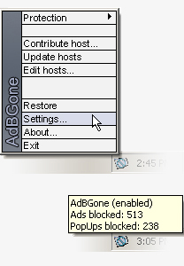



## AdBGone

### Description

AdBGone is an advanced popup and advertisement killer.

It will stop popups before they are displayed

and replace banners/advertisements with the AdBGone

logo, solid color, or HTML of your choice.

This was a project I started as an experiment to see

if I could generate any revenue from it.

I haven't done any work on this application since

August of 2003 so I believe I should give the source code away.

There is a registration feature on this application but the key

encoder is included under 'adbgone/encoder'. In order to enable protection you must first download

the known advertisement hosts from my site (www.ccorpsoft.com).

This can be done through the menu, under 'Update Hosts'.

There weren't many testers for this project so I am sure there

will be a bug or two. Enjoy. If you re-use my code please respect my project and keep

my name somewhere in the credits. Sincerely, Emanuel Miller (www.ccorpsoft.com)
 
### More Info
 

             |
---                |---
**Submitted On**   |2004-02-06 11:16:30
**By**             |[Emanuel Miller](https://github.com/Planet-Source-Code/PSCIndex/blob/master/ByAuthor/emanuel-miller.md)
**Level**          |Advanced
**User Rating**    |4.5 (36 globes from 8 users)
**Compatibility**  |VB 6\.0
**Category**       |[Complete Applications](https://github.com/Planet-Source-Code/PSCIndex/blob/master/ByCategory/complete-applications__1-27.md)
**World**          |[Visual Basic](https://github.com/Planet-Source-Code/PSCIndex/blob/master/ByWorld/visual-basic.md)
**Archive File**   |[AdBGone170496262004\.zip](https://github.com/Planet-Source-Code/emanuel-miller-adbgone__1-51538/archive/master.zip)

